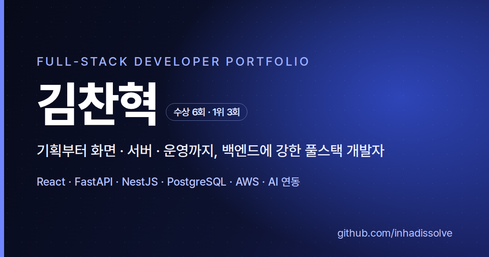

# 김찬혁 | Backend Developer Portfolio

> API 설계부터 트래픽 산정, 테스트, 배포와 운영까지 연결하는 백엔드 개발자입니다.

[](https://inhadissolve.github.io/portfolio/)
[](https://inhadissolve.github.io/portfolio/assets/resume.pdf?v=20260901)
[](https://inhadissolve.github.io/portfolio/assets/portfolio.pdf?v=20260901)
[](https://github.com/inhadissolve)
[](https://blog.naver.com/dissolve_chan)
[](https://app.notion.com/p/0f72a03e23d9832d8dc381d08168d0c7)

<p align="center">
  <a href="https://inhadissolve.github.io/portfolio/">
    
  </a>
</p>

## 포트폴리오 소개

순수 HTML · CSS · JavaScript로 만든 반응형 1페이지 포트폴리오입니다. 프로젝트 카드의 **자세히 보기**를 누르면 실제 화면, 아키텍처, 문제 해결 과정과 성과를 프로젝트별 사례 연구 형태로 확인할 수 있습니다.

- FastAPI · NestJS · PostgreSQL 기반 API와 데이터 모델 설계
- 서버리스 커넥션 상한, 폴링 기반 요청량, 컴퓨트 예산을 함께 고려한 운영 설계
- Docker · Railway · AWS · Terraform · GitHub Actions를 활용한 배포 및 운영
- 팀 리딩, Android 연동 계약 조율, 테스트 시나리오와 최종 스모크 테스트 주도
- AI 추론 API와 전처리 검증, OpenAI 호출 비용·생성 한도 관리

### 최신 문서

- [이력서 PDF](https://inhadissolve.github.io/portfolio/assets/resume.pdf?v=20260901)
- [프로젝트 포트폴리오 PDF](https://inhadissolve.github.io/portfolio/assets/portfolio.pdf?v=20260901)
- 문서 반영일: **2026.09.01**. 제공된 PDF 원본을 다운로드할 수 있습니다.

## 주요 성과

| 구분 | 내용 |
| --- | --- |
| 실서비스 운영 | 메모라이즈 전체 회원 449명, 14일 학습 완료 16,496회, 실측 최고 동시 접속 36명 |
| 테스트 | 백엔드 pytest 685개 · 프론트 테스트 331개, 총 1,016개 |
| 트래픽 설계 | 폴링이 모두 활성화된 탭 기준 1인당 시간당 약 270회 요청 산정, 예상 동시접속 100~300명 시나리오 검토 |
| 팀 리딩 · 연동 | 총 10인 HomeFit 팀의 백엔드 팀장으로 API 계약, PR 우선순위, 테스트 계정과 Android 통합 테스트 조율 |
| 클라우드 확장 | Railway 배포에서 AWS Terraform, GitHub Actions OIDC, PostgreSQL 18 데이터 이관까지 수행 |
| 개인 선정 | UMC 10th Backend(Node.js) 파트 베스트 챌린저 |
| 프로젝트 수상 | 탄소중립 Innovation Academy 대상, 오픈소스 SW 페스티벌 최우수상(인하대 총장상), KSEB 미니프로젝트 대상 |

> 회원 수는 2026.08.23, 운영 지표는 2026.08.10 ~ 08.23의 기록입니다. 테스트 수는 최신 이력서 기준입니다. 예상 동시접속 100~300명은 설계 가정이며 부하 테스트로 검증한 처리량이 아닙니다.

## 대표 프로젝트

| 프로젝트 | 역할 | 핵심 내용 | 결과 · 링크 |
| --- | --- | --- | --- |
| **메모라이즈 (Memorize)** | 1인 기획 · 개발 · 운영 | 암기 학습 웹서비스. 서버리스 커넥션 상한·폴링 부하·컴퓨트 예산 검토, API·DB 리전 정렬, AI 비용 가드레일 | [서비스](https://samuel-school.vercel.app) · [API 문서](https://samuel-school-api.vercel.app/docs) |
| **HomeFit** | 총 10인 팀 · Backend Team Lead | 청년 주거·금융 API, Stable Hash·Prisma Upsert 기반 멱등 Seed, Android 통합 테스트, AWS IaC·CI/CD·DB 이관 | [Showcase](https://github.com/inhadissolve/homefit-showcase) · [공식 GitHub](https://github.com/umc-homefit) |
| **컷메이트 (Cutmate)** | 1인 기획·개발 · 진행 중 (Claude Code 활용) | AI 쇼츠·영상 편집 로컬 도구(이지컷 벤치마킹). 받아쓰기+음량 기준 침묵 컷, OpenAI 호출별 비용 계기판(94분 영상 1회 약 799원, 98% 받아쓰기), SQLite 작업 대기열·재시작 복구, 사람 승인 업로드 | 로컬 도구 · 저장소 비공개 |
| **수담(手談)** | 7인 팀 팀장 · AI 파이프라인 | 10프레임 × 194차원 추론 API, 예측 스크립트 전처리 불일치 수정, 비수어 오탐·중복 출력 제어 | [공식 GitHub](https://github.com/KSEB-MEGA-CREW) |
| **RealGain** | AI/HW · 연동 모듈 | 24채널 진동 BIN → Orbit 이미지 → PyTorch·torchvision ResNet18 분류. Grad-CAM·JSON 추론 모듈 | [공식 GitHub](https://github.com/RealGain-5) |

### 수담에서 구현한 세 가지

1. **FastAPI·Docker 추론 API**: JPEG 프레임을 MediaPipe로 처리해 10프레임 × 194차원 텐서로 변환하고 라벨·신뢰도·상위 후보 반환.
2. **전처리 불일치 수정**: 학습에는 없던 샘플별 정규화를 실시간 예측 스크립트에서 제거해 입력 스케일 일치.
3. **오탐·중복 출력 제어**: 비수어 동작을 `none`으로 묶는 학습 로직과 예측 스크립트의 신뢰도 임계값·3회 연속 일치·중복 누적 방지.

추론 API의 현재 경로는 `POST /api/predict-word-from-frames`, 상태 확인 경로는 `GET /healthz`입니다. 전처리 수정과 연속 예측 안정화는 **실시간 예측 스크립트** 작업으로 구분합니다.

### 추가 구현 경험

- **IssueOne**: RSS 수집·정제·요약 API, 배포 메모리 제약을 외부 AI API로 해결. [공식 GitHub](https://github.com/KSEB-4-E)
- **GreenBrain**: 챌린지 인증, 피드, 토큰 보상 API와 Supabase Storage 연계. [Backend](https://github.com/GreenBrain-Inha/BE_GreenBrain)

HomeFit 현장 운영은 **2026.08.22 부산 BEXCO 데모데이**에 종료했습니다. 약 5분의 접속 불가 후 자동 복구를 관측했으나 원인은 별도 지표·활동 이력 대조가 필요합니다. Terraform의 ELB 헬스체크 기반 ASG 구성과 **RDS용** `CPUCreditBalance` 경보를 운영 구성으로 기록하며, 무중단이나 복구 시간 보장으로 표현하지 않습니다.

각 프로젝트의 화면과 상세 문제 해결 과정은 [포트폴리오 사이트](https://inhadissolve.github.io/portfolio/#projects)에서 확인할 수 있습니다.

## 기술 스택

```text
Language        Python 3.10+ · TypeScript 5.9 · JavaScript
Backend         FastAPI 0.140 / 0.110(수담) · NestJS 11 · Node.js 22
Database        PostgreSQL 18 · SQLAlchemy 2.0 · Prisma 6 · Alembic · SQLite
Cloud/Infra     AWS(ALB·EC2·RDS·ECR·S3) · Terraform 1.8 · Docker · CloudWatch
Test            pytest 8.3 · Jest 29 · Supertest · Testcontainers 12
AI/Data         OpenAI SDK 2.53 · PyTorch 2.8 · torchvision 0.23 · TensorFlow 2.13 · MediaPipe 0.10 · Pandas 2.2
Frontend        React 19.2 · Next.js 16.2 · Vite 7.2 · Tailwind CSS
Tools           Git · GitHub Actions OIDC · Vercel · Railway
```

## 저장소 구조

```text
.
├─ index.html              # 소개, 기술, 경험, 프로젝트와 7개 상세 다이얼로그
├─ css/style.css           # 반응형 UI, 라이트/다크 테마, 모달 애니메이션
├─ js/main.js              # 내비게이션, 테마, 스크롤 효과, 프로젝트 다이얼로그
└─ assets/
   ├─ homefit/             # HomeFit 화면, 아키텍처, 데모데이·수상 이미지
   ├─ projects/            # 프로젝트별 화면과 결과 이미지
   ├─ awards/              # 개인 수상·교육 수료 증빙 이미지
   ├─ tech/                # 로컬 기술 아이콘
   ├─ resume.pdf           # 최신 이력서
   ├─ portfolio.pdf        # 최신 프로젝트 포트폴리오 문서
   └─ og-image.png         # 링크 공유 미리보기
```

## 로컬 실행

별도 빌드 과정이 없는 정적 사이트입니다. 저장소를 클론한 뒤 `index.html`을 열거나 간단한 정적 서버를 실행하면 됩니다.

```bash
python -m http.server 8000
```

브라우저에서 `http://localhost:8000`으로 접속합니다.

## 배포

`main` 브랜치가 GitHub Pages에 연결되어 있습니다. 변경 사항을 병합하면 [포트폴리오 사이트](https://inhadissolve.github.io/portfolio/)에 반영됩니다.

## 아이콘 출처

기술 스택 아이콘은 [Simple Icons](https://simpleicons.org/), [Devicon](https://devicon.dev/)과 각 프로젝트의 공식 GitHub 자산을 사용합니다. 전용 브랜드 아이콘이 없는 도구는 공식 프로젝트 표기 또는 의미가 분명한 식별 기호를 사용했습니다.
